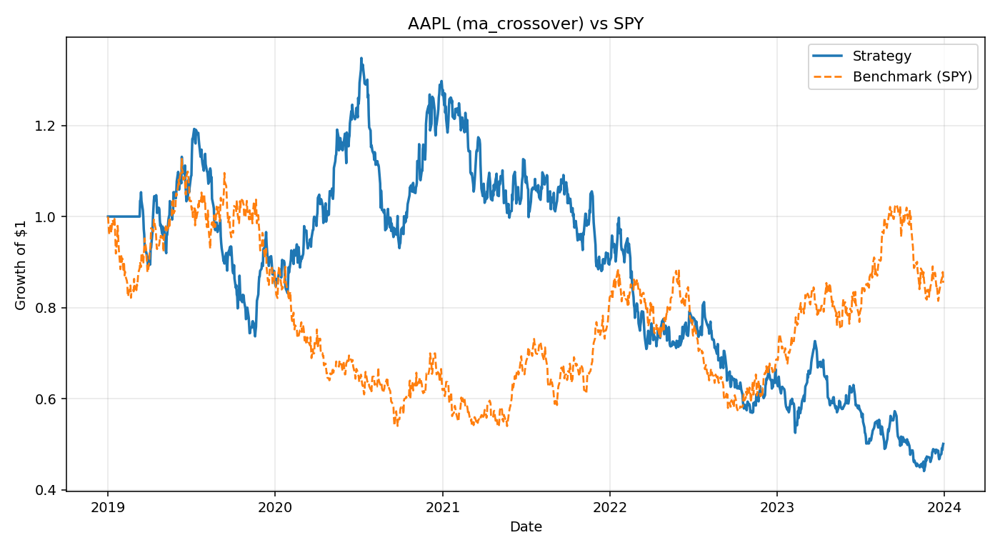

# Algorithmic Trading Strategy Backtester

A vectorized Python backtesting engine for equity trading strategies. It
ingests OHLCV price data, computes indicator-based signals, simulates
realistic trade execution (slippage, fees, position sizing), and reports
institutional-style performance metrics against a benchmark.



## Why this project exists

This is a demonstration of quantitative engineering fundamentals:
cleaning real-world time-series data, building signals with **no
lookahead bias**, simulating execution frictions instead of assuming
frictionless fills, and evaluating results with the metrics a PM or risk
desk would actually ask for (Sharpe, Sortino, max drawdown).

## Architecture

```
trading-backtester/
├── main.py                  # CLI entry point
├── src/
│   ├── data_ingestion.py    # fetch + clean OHLCV data (yfinance or synthetic fallback)
│   ├── signals.py           # vectorized indicator -> signal generation
│   ├── execution.py         # slippage, fees, position sizing, no-lookahead execution
│   ├── performance.py       # Sharpe, Sortino, drawdown, benchmark comparison, plotting
│   └── backtester.py        # orchestrates the full pipeline
└── tests/
    └── test_backtester.py   # correctness + no-lookahead-bias regression tests
```

**Data Ingestion** — Pulls daily OHLCV bars via `yfinance`. If the network
or the package is unavailable, it deterministically falls back to a
synthetic Geometric Brownian Motion price generator (seeded per ticker)
so the entire pipeline can be developed, tested, and demoed fully
offline. Missing bars are forward-filled only — never back-filled — to
avoid leaking future information into the past.

**Signal Generation Engine** — Produces `{-1, 0, 1}` position signals
using only vectorized pandas/numpy operations (rolling means, EWMA, no
Python-level loops over rows):
- Moving Average Crossover
- RSI mean-reversion (oversold/overbought bands)
- Rolling Z-Score mean reversion
- Pairs-trading spread Z-score (cointegration-style proxy)

**Execution & Cost Simulator** — Converts a signal into a P&L series:
- Signals are shifted forward one bar before being executed, so a
  strategy can never trade on information from the same bar that
  generated the signal.
- Per-trade **slippage** and **transaction fees** (in basis points) are
  charged proportional to turnover (position change), not just on every
  bar.
- **Position sizing** supports a fixed-fraction allocation or a
  volatility-targeting allocator that scales exposure to hit an
  annualized vol target.

**Performance Analytics Engine** — Computes Sharpe ratio, Sortino ratio,
max drawdown and its duration, and cumulative return vs. a benchmark
(defaults to SPY), plus a growth-of-$1 chart overlaying strategy and
benchmark.

## Installation

```bash
git clone <this-repo-url>
cd trading-backtester
pip install -r requirements.txt
```

## Usage

Run a single-ticker backtest:

```bash
python main.py --ticker AAPL --strategy ma_crossover --start 2019-01-01 --end 2023-12-31
```

```
=== AAPL | ma_crossover vs SPY ===
Total Return:             -49.91%
Annualized Return:        -12.51%
Annualized Volatility:     28.88%
Sharpe Ratio:               -0.32
Sortino Ratio:              -0.51
Max Drawdown:             -67.27%
Max Drawdown Duration:       1270 days
Benchmark Total Return:   -14.53%

Backtest computed in 0.035s
Saved equity curve plot to equity_curve.png
```

> Note: the numbers above come from this repo's offline synthetic-data
> fallback (no network access in the sandbox that generated this
> README), so they're illustrative of the pipeline, not a real AAPL
> result. Point `--start`/`--end` at a live environment with `yfinance`
> installed and network access to get real historical results.

Try a different strategy:

```bash
python main.py --ticker MSFT --strategy rsi --rsi-period 14
python main.py --ticker NVDA --strategy mean_reversion --zscore-window 20 --position-sizing vol_target
```

Measure raw vectorization throughput across a universe of tickers:

```bash
python main.py --benchmark-only --tickers AAPL MSFT GOOG AMZN META NFLX ORCL IBM INTC AMD
# Computed indicators for 10 tickers in 0.183s
```

On this test machine, computing three full indicator sets (MA
crossover, RSI, rolling Z-score) across 5 years of daily data for 10
tickers took **under 0.2 seconds** end-to-end — the kind of throughput
that vectorized NumPy/pandas operations make possible versus row-by-row
loops.

## Running tests

```bash
pip install pytest
pytest tests/ -v
```

Tests cover indicator correctness, execution-cost effects, and — most
importantly — a regression test asserting that a signal generated at bar
`t` cannot affect the simulated position until bar `t+1` (no lookahead
bias).

## Design choices worth calling out in an interview

- **No lookahead bias by construction**: signals are shifted before
  being multiplied against returns, and data cleaning only forward-fills.
- **Vectorized throughout**: no per-row Python loops in the hot path —
  indicators and P&L are computed with rolling/ewm/cumulative pandas ops.
- **Costs modeled on turnover, not on every bar**: fees and slippage are
  only charged when the position actually changes, matching how real
  trading costs work.
- **Pluggable strategy registry** (`STRATEGY_REGISTRY` in
  `backtester.py`) makes it straightforward to add a new signal function
  without touching the execution or performance layers.

## Possible extensions

- Walk-forward / rolling out-of-sample validation
- Multi-asset portfolio allocation and rebalancing
- Options pricing-based strategies (see the companion computational
  physics / Monte Carlo project)
- Parameter optimization with proper train/test splits to avoid
  overfitting
